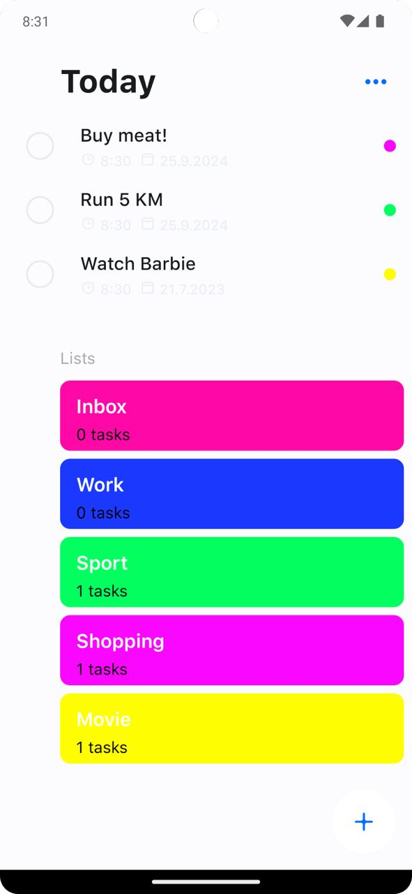

# A program written entirely in Kotlin using the principles of Clean Architecture according to the MVVM pattern.

An application for managing tasks. Written in Kotlin using the Jetpack Compose framework

## Screenshots

##Libries

* [Jetpack Compose](https://developer.android.com/jetpack/compose) Jetpack Compose is Android’s
  recommended modern toolkit for building native UI. It simplifies and accelerates UI development on
  Android. Quickly bring your app to life with less code, powerful tools, and intuitive Kotlin APIs.

* [Kotlin flows](https://developer.android.com/kotlin/flow) In coroutines, a flow is a type that can
  emit multiple values sequentially, as opposed to suspend functions that return only a single
  value. For example, you can use a flow to receive live updates from a database.

* [Kotlin Coroutines](https://github.com/Kotlin/kotlinx.coroutines) Coroutines is a rich library for
  coroutines developed by JetBrains. It contains a number of high-level primitives with support for
  coroutines, which are discussed in this guide, including startup, asynchrony, and others.

* [ViewModel](https://developer.android.com/topic/libraries/architecture/viewmodel) Data related to
  the user interface that is not destroyed when the application is rotated. Easily schedule
  asynchronous tasks for optimal execution.

* [Room](https://developer.android.com/jetpack/androidx/releases/room) The Room persistence library
  provides an abstraction layer over SQLite to allow for more robust database access while
  harnessing the full power of SQLite.

* [Lifecycle](https://developer.android.com/topic/libraries/architecture/lifecycle) An interface
  that automatically responds to lifecycle events.